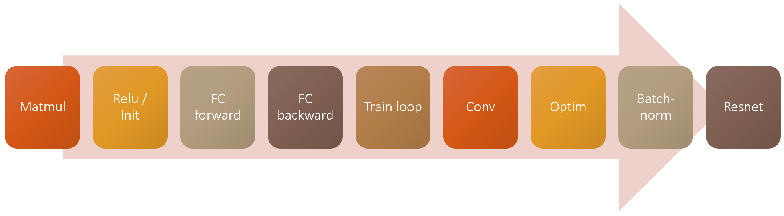

In this repository i'm trying to study the fastai course "Part 2 Deep Learning from the Foundations" [link!](https://course19.fast.ai/part2).

This course is trying to build the fastai libirary again from scratch. I quote from the course's website "_This time, we’re not learning practical things that we will use right 
away, but are learning foundations that we can build on. This is particularly important nowadays because this field is moving so fast. In this new course, we will learn to 
implement a lot of things that are inside the fastai and PyTorch libraries._".

Building the ready made functions that you call over and over in the code in every machine learning model from scratch allows you to know the low level of maths and the operations 

that are being done also, allows you to know how to fix the bugs or why the ready made functions code behave the way it behaves.

**The roles of the course:**

We will have to build up our code from scratch even from matrix multplication then we will face the same issues ready made fuctions faced before that are related to speed and 

accuracy and we will try to modify our code until we reach the ready made functions performace when we reach this point then we could use the ready made function.

Here is the image that we use to clear the roles "we have to use only the down level libiraries to reach to the top level ones".

  
   

**Notes:**

1 - I didn't upload the data folder which contains the MNIST dataset which the course uses so you should be able to change the get_data function in _02_fully_connected notebook 

and make the download = True to avoid errors. 

2 - The notebook that ends in skipped is actually the same notebook the course uses i downloaded it using git clone command because i will not code them now i want to finish the 

course and fundamentals first and make sure i understand them and implement them right then i will go back and implement the skipped notebooks by my self.
